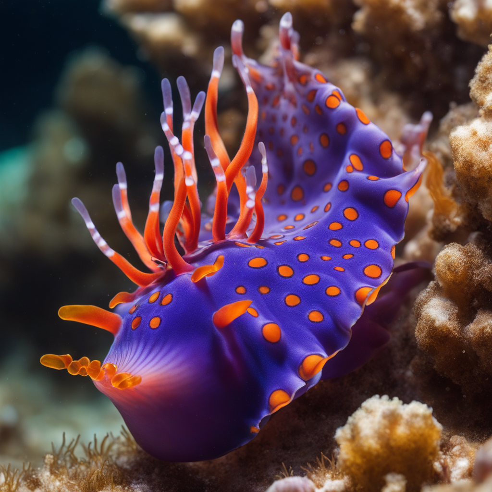

# ChatServer

`ChatServer` is a versatile FastAPI backend offering both audio-to-text transcription and advanced image generation capabilities. It is optimized for asynchronous processing of demanding tasks.

## Features

*   **Audio Transcription:** Converts audio files (e.g., WEBM, M4A, WAV) into text using OpenAI Whisper.
*   **Multilingual Transcription:** Supports specifying the audio language for improved accuracy.
*   **Text-to-Image Generation:** Creates images from textual descriptions using state-of-the-art models like SDXL and LCM.
*   **Image-to-Image Transformation:** Modifies existing images based on a text prompt.
*   **Asynchronous by Design:** Offloads resource-intensive operations to a separate thread pool to keep the server responsive.
*   **Dynamic Model Loading:** Image generation models are loaded on demand and cached for efficiency.

## Generated Image Examples

<table align="center">
  <tr>
    <td></td>
    <td></td>
  </tr>
  <tr>
    <td></td>
    <td></td>
  </tr>
</table>

## Technologies Used

*   **Python**
*   **FastAPI:** High-performance web framework.
*   **Uvicorn:** ASGI server for running the application.
*   **OpenAI Whisper:** For speech recognition.
*   **Diffusers Library:** For image generation pipelines.
*   **FFmpeg:** For audio format conversion.

## Prerequisites

*   **Python 3.9+**
*   **FFmpeg:** `brew install ffmpeg`

## Installation and Startup

1.  **Navigate to the project directory:**
    ```bash
    cd ./ChatServer
    ```

2.  **Create and activate a virtual environment:**
    ```bash
    python3 -m venv .venv
    source .venv/bin/activate
    ```

3.  **Install Python dependencies:**
    ```bash
    pip install -r requirements.txt
    ```

4.  **Start the Uvicorn server:**
    ```bash
    uvicorn app.main:app --host 0.0.0.0 --reload
    ```
    The server will be accessible at `http://127.0.0.1:8000`.

## API Usage

The server exposes two main API groups: `/transcript` and `/image`.

### Transcription API (`/audio`)

#### `POST /audio/decode`

*   **Description:** Transcribes an audio file into text.
*   **Form Parameters (`multipart/form-data`):
    *   `file` (type `File`): The audio file to transcribe.
    *   `language` (type `Form`, `string`): The language of the audio (e.g., `"english"`, `"fr"`).

*   **Example (`curl`):**
    ```bash
    curl -X POST \
      -F "file=@/path/to/your/audio.webm" \
      -F "language=english" \
      http://127.0.0.1:8000/audio/decode
    ```

### Image Generation API (`/image`)

#### `POST /image/generate`

*   **Description:** Generates or modifies an image. Returns a streaming response of progress events.
*   Form Parameters (`multipart/form-data`):
    *   `prompt` (`string`): The main text prompt describing the desired image.
    *   `model_name` (`string`, optional): The generation model to use (`"sdxl"` or `"lcm"`). Defaults to `"sdxl"`.
    *   `steps` (`int`, optional): Number of diffusion steps. Defaults to `25`.
    *   `negative_prompt` (`string`, optional): Terms to exclude from the image.
    *   `strength` (`float`, optional): Influence of the input image in image-to-image tasks (0.0 to 1.0).
    *   `use_refiner` (`bool`, optional): Whether to use the SDXL refiner model.
    *   `image` (`File`, optional): An input image for image-to-image generation.

*   **Example (Text-to-Image):**
    ```bash
    curl -X POST \
      -F "prompt=A futuristic cityscape at sunset" \
      http://127.0.0.1:8000/image/generate
    ```

#### `GET /image/models`

*   **Description:** Lists available image generation models and their loaded status.
*   **Example (`curl`):**
    ```bash
    curl -X GET http://127.0.0.1:8000/image/models
    ```

## Model Configuration

### Transcription Model

The Whisper model (`large-v3-turbo`) is configured in `app/whisper_utils.py`. You can switch to a smaller model (e.g., `"medium"`, `"base"`) for faster performance if needed.

### Image Generation Models

The image generation models (SDXL, LCM) are defined in `app/constants.py`. Models are downloaded automatically on first use and cached in your home directory (e.g., `~/.cache/huggingface/hub/`).

## Model Disk Space Requirements
Note: On the first run, the Whisper model (`large-v3-turbo`) will be automatically downloaded and cached in `~/.cache/whisper/`.

Diffusion models will be downloaded on first run in `~/.cache/huggingface/hub` once you login using [HuggingFace CLI](https://huggingface.co/docs/huggingface_hub/guides/cli)

*   **Transcription (Whisper large-v3-turbo):** ~1.62 GB
*   **SDXL Base:** ~7.11 GB
*   **SDXL Refiner:** ~4.69 GB
*   **LCM LoRA:** ~5.14 GB

## Docker Container Information

The size of the Docker image will be significant due to the inclusion of multiple large models.

*   With the **`tiny`** Whisper model, the image size is approximately **1.97 GB**.
*   With the **`large-v3`** Whisper model and image generation libraries, the size can exceed **10 GB**.

### Building the Docker Image

```bash
docker build -t chatserver .
docker run -d -p 8000:8000 --name chatserver-container chatserver
```